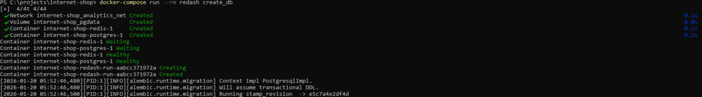
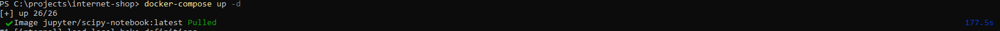
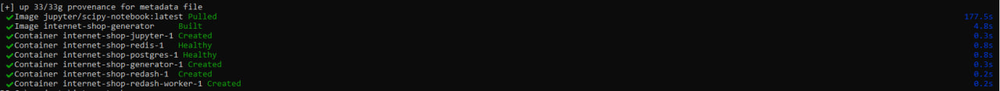
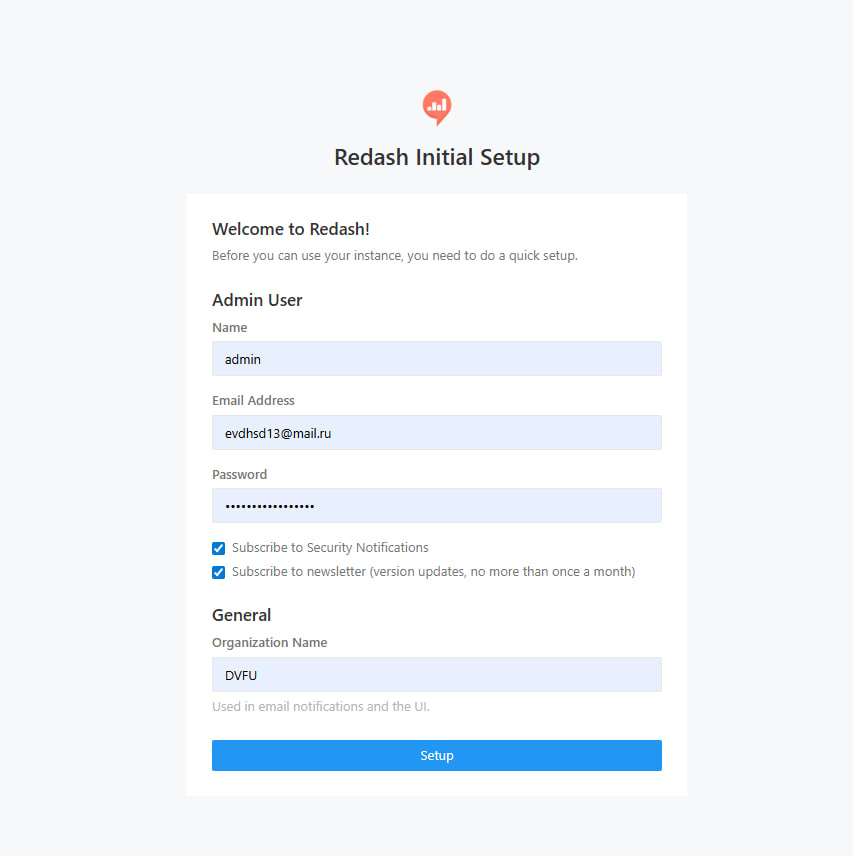
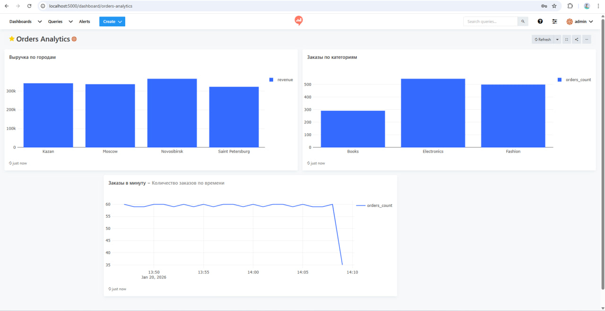

# Система сбора и анализа данных для интернет-магазина

## Описание проекта

Этот проект представляет собой простую end-to-end систему для генерации, хранения и анализа данных интернет-магазина.  
Система автоматически создаёт заказы с реалистичными данными, сохраняет их в PostgreSQL, а затем предоставляет возможность анализа через **Redash** и **Jupyter Notebook**.

**Работу выполнил: Луцук Иван Дмитриевич.**

### Компоненты

1. **Генератор данных**  
   - Скрипт на Python (`generate_orders.py`), который создаёт заказы с интервалом 1 секунда.  
   - Каждая запись содержит:
     - `product_name` — название товара  
     - `category` — категория товара  
     - `price` — цена  
     - `quantity` — количество  
     - `city` — город покупки  
     - `created_at` — дата и время создания заказа  

2. **База данных PostgreSQL**  
   - Хранит все сгенерированные заказы.  

3. **Redash**  
   - Используется для визуализации данных и построения дашбордов.  
   - Подключается к PostgreSQL.  
   - В проекте создан дашборд с 3+ визуализациями:
     - Выручка по городам 
     - Заказы по категориям
     - Количество заказов по времени

4. **Jupyter Notebook**  
   - Для интерактивного анализа данных.  
   - Используются библиотеки: `pandas`, `matplotlib`, `psycopg2`.  
   - Примеры аналитики:
     - Общая выручка по категориям
     - Построение графиков и диаграмм
     - Создание новых метрик (например, `total_price = price * quantity`)

---

# Быстрый старт
## Предварительные требования
- Docker и Docker Compose
- Windows / macOS / Linux  
- Браузер для работы с Redash и Jupyter Notebook 

## Установка и запуск
```
# 1. Клонируйте репозиторий
git clone https://github.com/Mentosha/internet-shop
cd internet-shop

# 2. Создать файл .env
# Переименовать .env.example в .env
# При необходимости изменить пароль и ключи

# 3. Инициализировать базу Redash при первом запуске:
docker-compose run --rm redash create_db

# 4. Запустите все сервисы
docker-compose up -d

# 5. Откройте Redash в браузере
http://localhost:5000
```
# Первоначальная настройка
## При первом входе в Redash (http://localhost:5000):

- Зарегистрируйте первого пользователя (он станет администратором)

- Настройка источника данных в Redash:

  - Перейдите в Settings → Data Sources

  - Нажмите + New Data Source

  - Выберите PostgreSQL

  - Заполните настройки:
    - Type: PostgreSQL
    - Host: postgres
    - Port: 5432
    - Database: analytics
    - User: analytics
    - Password: yourpassword (взять из .env)

## Примеры SQL-запросов для визуализаций:

**1. Количество заказов по времени:**
```sql
SELECT
  date_trunc('minute', created_at) AS time,
  COUNT(*) AS orders_count
FROM orders
GROUP BY time
ORDER BY time;
```

**2. Заказы по категориям:**
```sql
SELECT
  category,
  COUNT(*) AS orders_count
FROM orders
GROUP BY category
ORDER BY orders_count DESC;
```

**3. Выручка по городам:**
```sql
SELECT
  city,
  SUM(price * quantity) AS revenue
FROM orders
GROUP BY city
ORDER BY revenue DESC;
```
# Jupyter Notebook

В Jupyter Notebook был выполнен базовый анализ данных заказов интернет-магазина, загруженных из базы данных PostgreSQL.
Доступен по адресу http://localhost:8888 в браузере. Вход выполняется по токену из .env.

**В ходе анализа:**

- Выполнено подключение к базе данных и загрузка всех заказов в pandas DataFrame

- Преобразовано поле created_at в формат даты и времени

- Рассчитана дополнительная метрика total_price (стоимость заказа)

**Проанализированы ключевые показатели:**

- Общее количество заказов

- Общая выручка

**Выполнен агрегационный анализ:**

- Выручка по категориям товаров

- Количество заказов по категориям

- Средний чек по категориям

**Построены визуализации:**

- Столбчатая диаграмма выручки по категориям

- Столбчатая диаграмма количества заказов по категориям

- Линейный график динамики заказов во времени (по минутам)

# Скриншоты

### Инициализация базы Redash


### Загрузка системы



### Регистрация в Redash


### Дашборд Redash



# Структура проекта

```
internet-shop/
│
├─ .gitignore                  # Файлы и папки, которые не коммитить в Git
├─ generate/
│   ├─ generate_orders.py      # Скрипт генерации заказов
│   ├─ requirements.txt        # Зависимости для генератора
│   └─ Dockerfile              # Docker образ генератора
├─ screenshots/                # Скриншоты для README
│   ├─ redash.jpg     
│   ├─ start1.png       
│   ├─ start2.jpg       
│   ├─ registration.jpg       
│   └─ dashboard.jpg     
├─ notebooks/
│   └─ analysis.ipynb           # Jupyter Notebook для анализа
├─ db/
│   └─ init.sql                # Начальная инициализация базы данных
├─ docker-compose.yml           # Конфигурация всех сервисов
├─ .env                         # Переменные окружения
└─ README.md                    # Подробное описание проекта
```
